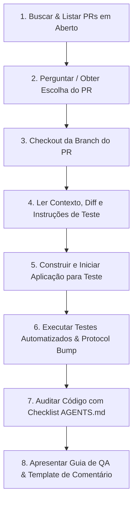

# Skill de Revisão de PR & Teste Rápido (Monky)

Esta skill guia o processo de auditoria de código, verificação técnica e inicialização rápida do ambiente de testes para Pull Requests no repositório **Monky**, aplicando com rigor as diretrizes de engenharia de software e fluxo de trabalho do [AGENTS.md](../../../AGENTS.md).

---

## 🎯 Fluxo de Execução Passo a Passo



---

## Passo 1: Buscar & Listar PRs em Aberto

Execute o comando `gh` para listar os PRs abertos no repositório:

```bash
gh pr list --state open --json number,title,headRefName,author,updatedAt --template "{{range .}}#{{.number}} - {{.title}} (branch: {{.headRefName}}, autor: {{.author.login}}){{\"\n\"}}{{end}}"
```

Apresente a lista formatada ao usuário e solicite qual PR ele deseja revisar e testar (caso o número do PR já não tenha sido informado na mensagem inicial).

---

## Passo 2: Checkout da Branch do PR

Após a definição do número do PR (`<PR_NUMBER>`):

1. Faça o checkout da branch do PR:
   ```bash
   gh pr checkout <PR_NUMBER>
   ```
2. Caso ocorra conflito de branch local, use `git checkout` ou sincronize com a branch remota.

---

## Passo 3: Ler Contexto do PR e Mudanças

1. **Obter detalhes, descrição e comentários do PR:**
   ```bash
   gh pr view <PR_NUMBER> --comments
   ```
2. **Listar arquivos alterados e escopo:**
   ```bash
   git diff main...HEAD --name-only
   ```
3. **Analisar áreas modificadas do Monorepo:**
   - `apps/client/`: Mudanças no app Electron/Renderer/Áudio/WebRTC.
   - `apps/server/`: Mudanças no servidor WebSocket/SQLite/Sinalização.
   - `packages/shared/`: Mudanças nos contratos de IPC, protocolo WebSocket, tipos e validadores.
   - `apps/server-gui/`: Mudanças na interface visual do servidor.
   - `docs-site/` ou `docs/`: Documentação e documentação traduzida (PT/EN).
   - `native/screen-audio`: Módulo nativo C++/Node-API.
4. **Extrair o Guia de QA existente:**
   - Verifique se a descrição do PR ou comentário na issue associada já possui a seção `### 🧪 Como testar (Guia de Validação para QA)`. Se não possuir, elabore uma a partir das alterações inspecionadas.

---

## Passo 4: Construir e Iniciar a Aplicação para Teste Rápido

Para que o testador valide o PR imediatamente sem atrito, prepare o ambiente e inicie os componentes necessários:

1. **Build das Dependências Compartilhadas:**
   ```bash
   npm run build
   ```
   *(Ou build específico caso apenas o servidor ou cliente tenha sido modificado, ex.: `npm run build:server`)*

2. **Inicializar a Aplicação de Acordo com o Escopo:**

   - **Se alterou o Cliente Desktop (`apps/client` ou `packages/shared`):**
     Inicie o cliente Electron:
     ```bash
     npm start
     ```
     *(Ou se o testador preferir dev server com Vite: `npm run dev:client` em background e `npm start`)*

   - **Se alterou o Servidor (`apps/server`):**
     Inicie o servidor local em background/daemon:
     ```bash
     npm run dev:server
     ```
     E se necessário abrir o cliente para conectar ao servidor: `npm start`.

   - **Se alterou a Documentação (`docs-site`):**
     Inicie o servidor do VitePress:
     ```bash
     npm run docs:dev
     ```

3. **Exibir o Guia de Validação Prática:**
   Forneça ao testador os passos diretos para exercitar a funcionalidade alterada com a aplicação aberta.

4. **Armadilhas do Monky que invalidam o teste:**

   Confira estes quatro pontos **antes** de entregar o roteiro — cada um já fez teste passar ou falhar pelo motivo errado.

   - **Cliente e servidor têm de vir da mesma branch.** `packages/shared/src/validators.ts` compara `protocolVersion` por igualdade exata contra `PROTOCOL_VERSION` (`packages/shared/src/constants.ts`). Se o PR mexeu no protocolo, o app da branch **não conecta** num servidor que já estava no ar. O roteiro deve mandar criar o servidor pelo próprio app da branch, e não reaproveitar um existente.
   - **Só abre uma instância por máquina.** `apps/client/src/main/main.ts` usa `app.requestSingleInstanceLock()`; o segundo `npm start` apenas foca a janela aberta. Para testar dois participantes, são duas máquinas — ou uma segunda instância com `--user-data-dir` próprio.
   - **Voz, vídeo e tela são P2P e não se validam sozinho.** PR que toca `apps/client/src/renderer/core/WebRtcManager.ts`, `VideoService.ts`, `core/webrtc/` ou a sinalização do servidor precisa de **duas pessoas conectadas**; abrir o app e olhar a própria tela não exercita o caminho.
   - **Use `MONKY_HOME` para não sujar os servidores reais.** O registro de servidores do CLI fica em `~/.monky` (`apps/server/src/cli/registry.ts`). Apontando `MONKY_HOME` para uma pasta descartável, o servidor de teste não entra na lista de quem está testando:
     ```bash
     MONKY_HOME=$(mktemp -d) npm run dev:server
     ```

---

## Passo 5: Executar Testes Automatizados & Verificações do CI

Execute a suite de testes locais para garantir que não houve regressão:

```bash
# 1. Rodar suite completa de testes e versionamento
npm test

# 2. Verificar conformidade de protocolo / breaking changes
node scripts/check-protocol-bump.js
```

---

## Passo 6: Auditoria Técnica de Código (Checklist AGENTS.md)

Inspecione o diff do código (`git diff main...HEAD`) e avalie os seguintes pontos críticos (detalhados em [agents_guidelines.md](./references/agents_guidelines.md)):

### 1. 🔹 Electron, IPC & Segurança
- `contextIsolation: true` e `nodeIntegration: false` mantidos.
- Tipagem estrita de IPC via `packages/shared/src/ipc.ts` (sem strings mágicas ou `any`).
- Sem memory leaks em listeners de IPC (`ipcRenderer.on` / `ipcMain.on` duplicados).
- Sanitização de inputs no Main Process (abertura de links com `shell.openExternal`, validação de caminhos).

### 2. 🔹 WebRTC, Áudio & Vídeo
- Teardown completo de `RTCPeerConnection` e `MediaStreamTrack.stop()`.
- Cleanup na Web Audio API (`AudioContext.close()`, desconexão de nós).
- Resiliência contra race conditions em trocas de SDP/ICE.

### 3. 🔹 Módulo Nativo C++ (`@monky/screen-audio`)
- Memory safety e liberação de buffers WASAPI/CoreAudio.
- Uso de `napi_threadsafe_function` para callbacks sem travar a thread do Node.js.
- Tratamento de exceções para evitar crash no processo Main.

### 4. 🔹 Renderer Vanilla TS & DOM
- Limpeza rigorosa de event listeners (`removeEventListener`, `EventBus.off`).
- Mutações de estado centralizadas nas Stores sem dependências circulares.
- Prevenção de reflows excessivos e re-renderizações desnecessárias.

### 5. 🔹 Servidor & Clean Architecture
- Separação clara: `domain`, `application`, `infrastructure`.
- SQLite com queries parametrizadas e transações em lote.
- Heartbeats de WebSocket (ping/pong) e remoção de peers desconectados.

### 6. 🔹 Rigor TypeScript & Protocol Version
- Zero `any` e sem asserções forçadas (`as unknown as Type`).
- Se houve breaking change no protocolo ou mensagens, verificar se o SemVer reflete versão Major (`feat!:` / `major:`).

---

## Passo 7: Relatório Didático & Template de Comentário

Ao concluir a análise, apresente:
1. **Resumo Executivo da Revisão:** O que a alteração faz e avaliação técnica.
2. **Pontos de Atenção / Sugestões (se houver):** Explicando a causa-raiz, sintoma real e sugestão de código refatorado.
3. **Template de Comentário em PT-BR Pronto para Uso:** Estruturado conforme exigido no [AGENTS.md](../../../AGENTS.md) (consulte [qa_comment_template.md](./references/qa_comment_template.md)).

---

## 📚 Arquivos de Referência

- [Diretrizes Técnicas e de Arquitetura (AGENTS.md)](./references/agents_guidelines.md)
- [Templates de Comentário para Issue e QA](./references/qa_comment_template.md)
