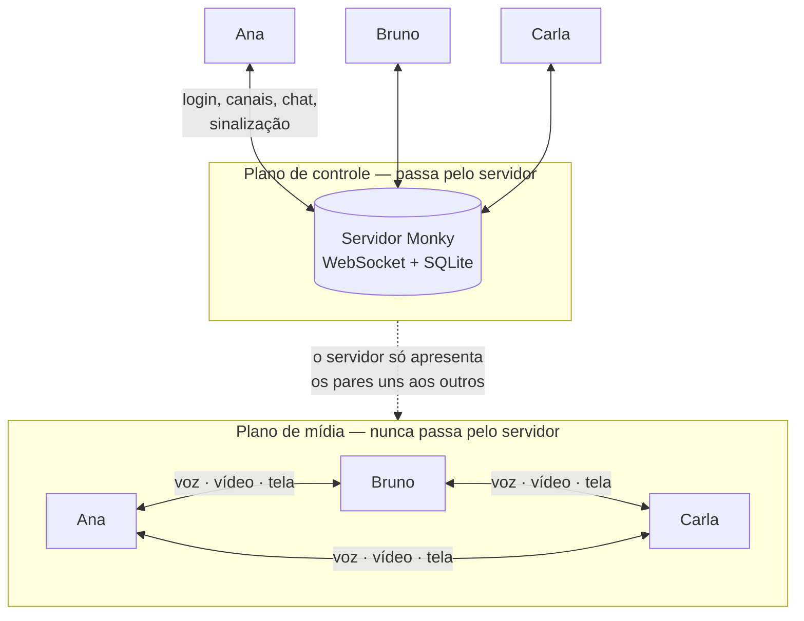
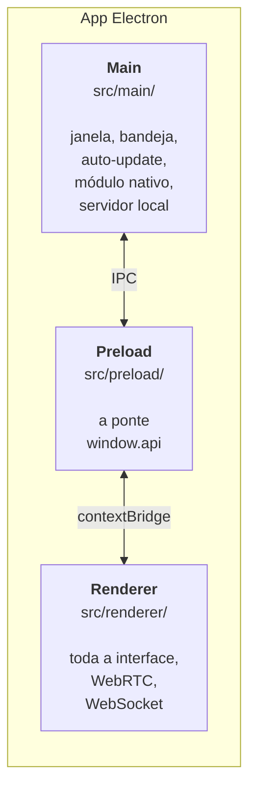
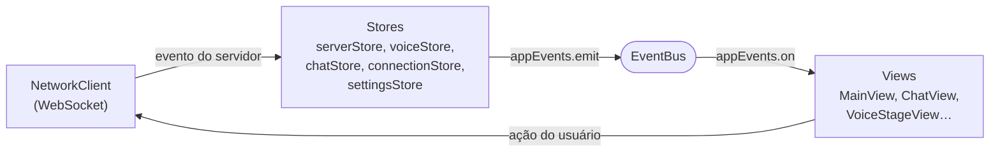
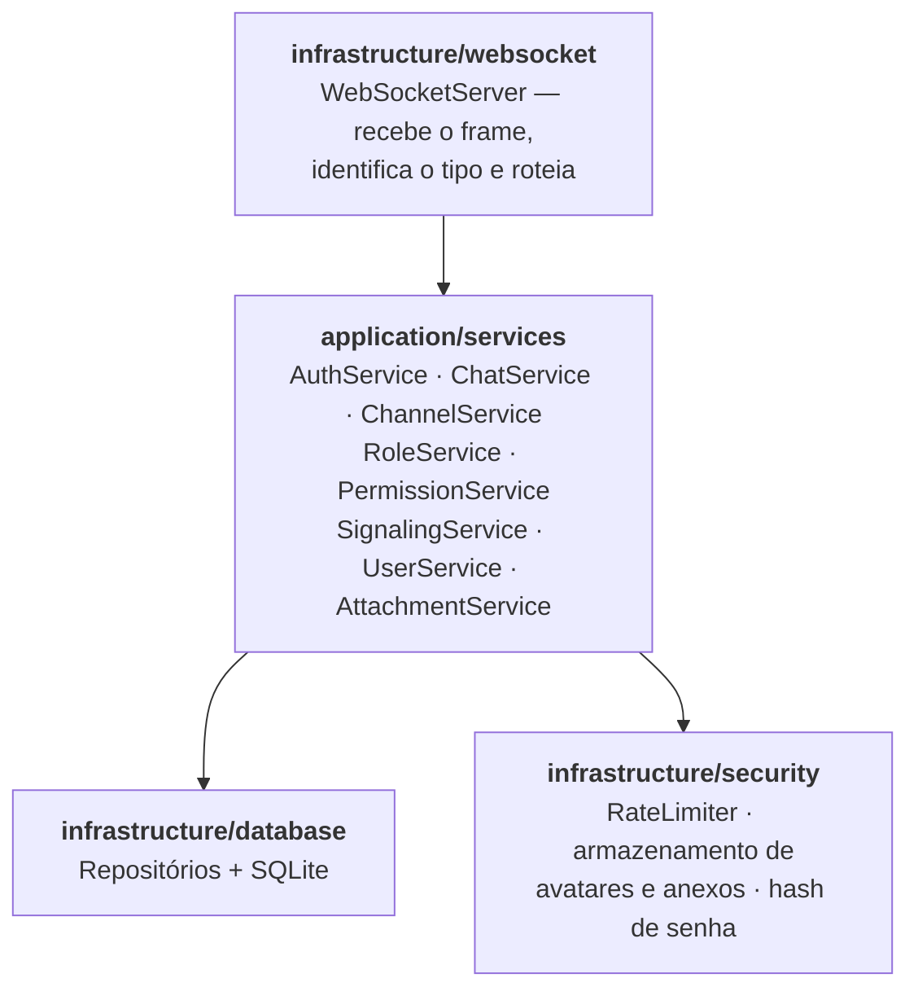
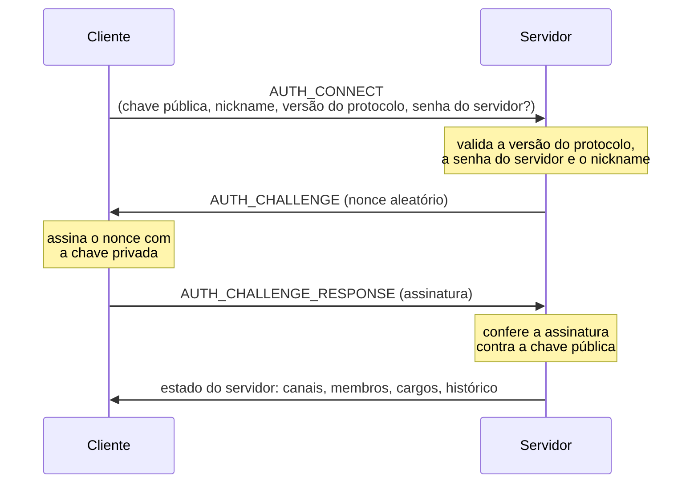
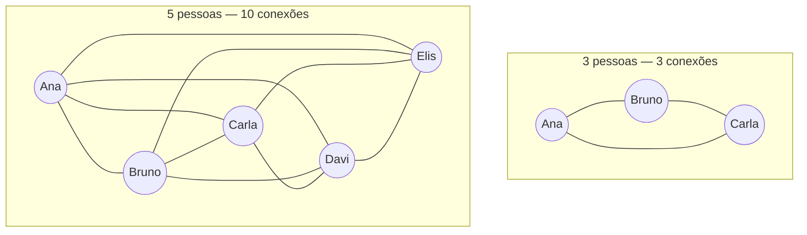
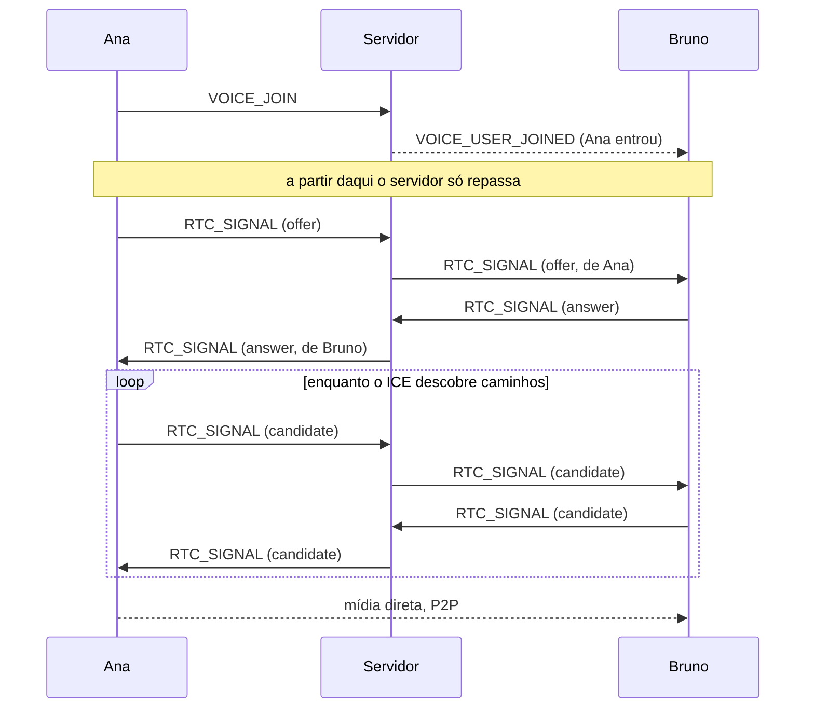
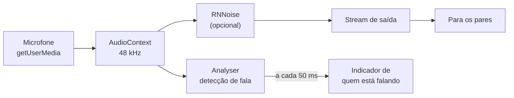

# Arquitetura

Como o Monky é construído por dentro: os componentes, como eles conversam e por
que as decisões foram tomadas desse jeito.

Esta página descreve o **que existe hoje no código**. Se você procura a
especificação original do projeto — com MVP, fases e ideias futuras —, ela está
em [`docs/especificacao-tecnica.md`](https://github.com/MonkyOrg/Monky/blob/main/docs/especificacao-tecnica.md).

## A ideia central: dois planos separados

Tudo no Monky parte de uma separação: **o que o servidor controla** e **o que
trafega direto entre as pessoas**.



O servidor cuida de login, canais, chat, cargos e **sinalização**. Ele apresenta
os participantes uns aos outros e sai da frente: voz, vídeo e tela trafegam
**P2P via WebRTC**, sem passar por ele.

Isso tem duas consequências que explicam quase todo o resto do projeto:

- **A banda do servidor quase não importa.** Ele não carrega mídia, então um VPS
  modesto aguenta o grupo. O custo de banda fica com os participantes.
- **A conversa não é legível pelo servidor.** Mesmo quem hospeda não consegue
  ouvir a chamada — o WebRTC é criptografado ponta a ponta entre os pares.

## Os componentes

O repositório é um monorepo com workspaces npm:

| Workspace | O que é |
|---|---|
| `apps/client` | O app Electron — a interface, e também o anfitrião quando você hospeda pelo próprio app |
| `apps/server` | O servidor: WebSocket, SQLite e o [Monky CLI](/cli) |
| `packages/shared` | O contrato entre os dois: tipos do protocolo, validadores, limites e perfis de qualidade |

`packages/shared` é o que impede cliente e servidor de divergirem: os dois
importam os **mesmos** tipos e os **mesmos** validadores.

## O cliente

### Três processos

O Electron separa o app em três contextos, e o Monky respeita essa separação:



O renderer roda com `contextIsolation: true` e `nodeIntegration: false`: a
interface **não tem acesso ao Node**. Tudo que precisa do sistema operacional —
escolher uma tela para compartilhar, ler o módulo nativo de áudio, mexer na
bandeja — passa pela ponte `window.api` exposta pelo preload.

### A interface não usa framework

Talvez a decisão mais incomum do projeto: **o renderer é TypeScript e DOM puro**.
Não há React, Vue ou Svelte. As telas montam o próprio HTML com template strings
e se re-renderizam.

O estado fica em *stores* singleton que emitem eventos num barramento
(`appEvents`), e as telas se inscrevem no que lhes interessa:



### Os serviços

Cada responsabilidade grande do cliente vive em uma classe própria, em
`src/renderer/core/`:

| Serviço | Responsabilidade |
|---|---|
| `NetworkClient` | WebSocket, autenticação, heartbeat e reconexão |
| `WebRtcManager` | As conexões P2P: mesh, tracks, renegociação |
| `AudioProcessor` | Microfone, supressão de ruído, detecção de fala |
| `VideoService` | Câmera e captura de tela |
| `ScreenAudioService` | Ponte do módulo nativo de áudio de tela para o WebRTC |
| `ParticipantManager` | Quem está online, em qual canal e com qual estado |
| `SoundboardService` | Sons e atalhos do soundboard |
| `KeybindService` | Atalhos globais |
| `AttachmentUploader` | Upload de anexos do chat |
| `UpdateService` | Verificação e aviso de atualização |

### O que fica salvo na sua máquina

Tudo do lado do cliente é `localStorage` — não há banco local:

| Chave | Conteúdo |
|---|---|
| `monky_settings` | Preferências: qualidade, dispositivos, volumes, atalhos, soundboard |
| `monky_nickname` / `monky_avatar` | Sua identidade visual |
| `monky_saved_servers` | Servidores que você salvou para reconectar |
| `monky_created_servers` | Servidores que você criou nesta máquina |
| `monky_device_id` | Identifica **este dispositivo** (permite a mesma pessoa em dois aparelhos) |
| `monky_language` | Idioma da interface |

## O servidor

### Camadas

Não há container de injeção de dependência: a montagem é explícita, feita à mão
em `MonkyServer.create()`. Você consegue ler o arquivo e ver exatamente o que
depende do quê.



Além do WebSocket, o servidor expõe algumas rotas HTTP: `/health`, `/preview` e
`/invite-info` (informações públicas para a tela de convite), `/avatars/*` e o
upload/download de `/attachments`.

A porta padrão é a **3000**.

### O protocolo

Toda mensagem tem o mesmo formato:

```ts
{
  type: MessageType,     // 'CHAT_SEND', 'VOICE_JOIN', 'RTC_SIGNAL'…
  requestId?: string,    // volta na resposta, para correlacionar
  payload: T
}
```

O `requestId` é o que permite ao cliente saber qual resposta pertence a qual
pedido — o WebSocket é assíncrono e as respostas não chegam necessariamente na
ordem em que foram feitas.

A validação dos payloads usa **zod**, com os schemas em `packages/shared` —
os mesmos que o cliente usa para validar antes de enviar.

::: warning A versão do protocolo é exata, não compatível
`PROTOCOL_VERSION` (hoje **3**) precisa ser **idêntica** nos dois lados. Não há
negociação nem modo de compatibilidade: se o cliente manda uma versão diferente
da do servidor, a autenticação é recusada.

É por isso que subir o protocolo é sempre uma *breaking change* e obriga uma
release **major** — existe até uma verificação no CI que barra o PR se isso não
for respeitado.
:::

### Autenticação: o servidor nunca vê uma senha sua

O login é por desafio-resposta com criptografia de chave pública. Você não tem
conta nem cadastro: sua identidade **é** o seu par de chaves.



O `clientId` é derivado da própria chave pública, então ele não pode ser
falsificado: quem não tem a chave privada não consegue assinar o desafio.

A senha do servidor, quando existe, protege a *entrada* — é conferida antes de o
desafio ser emitido.

### Sessões: a mesma pessoa em vários aparelhos

Uma sessão é identificada por `userId:deviceId`, não só pelo usuário. É isso que
permite você estar no desktop e no notebook ao mesmo tempo, aparecendo como uma
pessoa só.

- Reconectar **do mesmo aparelho** substitui a conexão antiga (evita fantasmas
  depois de uma queda de rede).
- Conectar **de outro aparelho** cria uma sessão nova, até o limite de **3
  sessões simultâneas** por identidade.

O limite existe porque a capacidade do servidor (`maxUsers`) conta *pessoas*.
Sem o teto, uma identidade já conectada poderia abrir conexões sem fim e furar
esse limite.

### Banco de dados

SQLite, em um arquivo `server.db` dentro da pasta de dados do servidor. As
migrações são arquivos `.sql` numerados, aplicados na subida e registrados numa
tabela `schema_migrations` — o servidor só roda o que ainda não rodou.

| Tabela | Guarda |
|---|---|
| `server_meta` | Configuração do servidor: nome, senha, dono, limites, ícone |
| `users` | Membros, com a chave pública de cada um |
| `channels` | Canais de voz e de texto |
| `messages` | Histórico do chat |
| `mentions` | Menções, para destacar e notificar |
| `message_attachments` | Anexos das mensagens |
| `roles` / `user_roles` | Cargos e quem tem cada um |
| `schema_migrations` | Controle das migrações já aplicadas |

### Cargos e permissões

Permissões são bits combinados numa máscara. Dois cargos são especiais:

- **Admin** — recebe todas as permissões e não pode ser apagado.
- **Membro** — o cargo padrão de quem entra.

A checagem é centralizada em `PermissionService.checkPermission()`. O **dono do
servidor** é um caso à parte: ele recebe as permissões de admin
independentemente dos cargos que tenha.

### Proteção contra abuso

| Proteção | Como |
|---|---|
| Flood de mensagens | Janela deslizante: 10 mensagens a cada 5 s |
| Tamanho da mensagem | 2000 caracteres |
| Avatar | 5 MB, e o arquivo precisa ter assinatura de PNG, JPEG ou WebP |
| Anexos | Limite por arquivo e orçamento total do servidor, ambos configuráveis |
| Soundboard | Áudio recusado acima de ~4 MB |
| Path traversal | Nomes de arquivo passam por `basename` e o caminho final é conferido contra a pasta permitida |

Repare no detalhe do avatar: a validação olha os **bytes mágicos** do arquivo, e
não a extensão. Renomear um executável para `.png` não engana a checagem.

## O plano de mídia

### Topologia: mesh completo

Cada participante abre uma conexão direta com **cada** um dos outros.



Com **N** participantes, cada pessoa mantém **N−1** conexões e o canal tem
**N(N−1)/2** no total. Quem compartilha tela envia o mesmo vídeo N−1 vezes,
uma para cada par.

::: tip Por que mesh, e onde isso dói
Mesh não precisa de servidor de mídia: dá para hospedar o Monky num VPS baratinho
porque ele nunca carrega vídeo. O preço é o **upload de quem transmite**, que
cresce de forma linear com o número de ouvintes.

Para o grupo de amigos que o Monky atende, isso é excelente. Para dezenas de
pessoas, seria preciso um SFU — e aí o servidor voltaria a carregar mídia.
:::

### Sinalização

O servidor só entrega envelopes. Ele reescreve o remetente (para ninguém forjar
identidade) e recusa a entrega se os dois pares não estiverem no mesmo canal de
voz.



### Atravessando o NAT

Quase ninguém tem IP público direto, então os pares precisam descobrir por onde
se alcançam. O Monky usa **servidores STUN** públicos (Google e Cloudflare) para
cada lado descobrir seu próprio endereço externo.

::: warning Não há servidor TURN
STUN só *descobre* o caminho; ele não repassa nada. Quando a rede é restritiva
demais — NAT simétrico, firewall corporativo, alguns CGNATs de operadora — não
existe caminho direto e a conexão de mídia falha.

Um servidor TURN resolveria, retransmitindo a mídia. Mas TURN carrega vídeo, e
custa banda proporcional ao uso — o que reintroduz exatamente o custo que a
arquitetura P2P evita. Hoje o Monky não tem TURN.
:::

Quando uma conexão cai ou trava, o `WebRtcManager` primeiro tenta um **ICE
restart** (renegociar o caminho sem derrubar a chamada) e, se não resolver,
refaz a conexão do zero com aquele par.

### Áudio



A captura já pede cancelamento de eco e ganho automático ao navegador. A
supressão de ruído tem um detalhe: quando você liga o **RNNoise** do Monky, a
supressão nativa do navegador é **desligada** — as duas juntas se atrapalham e o
resultado fica pior.

Mudo e ensurdecer desabilitam a track (`enabled = false`) em vez de removê-la.
Assim não é preciso renegociar a conexão a cada clique no botão de mudo.

### Vídeo e compartilhamento de tela

A câmera segue as dimensões e o FPS do perfil de qualidade escolhido.

O compartilhamento de tela é uma track **separada** da câmera — você pode
transmitir as duas ao mesmo tempo. Ao começar a compartilhar, a conexão é
renegociada e o Monky manda junto um `screen-video-meta` para que o outro lado
saiba que aquela track é uma tela, e não um rosto.

Dá para compartilhar **até 2 telas simultâneas**. Cada uma é identificada pelo id
do seu próprio `MediaStream`, e é esse id que amarra a track, o sender e o
quadradinho na tela.

O Monky também marca a track com uma dica de conteúdo: `motion` prioriza
fluidez (bom para jogos e vídeo), `detail` prioriza nitidez (bom para código e
texto).

### Áudio da tela: o módulo nativo

O navegador não entrega o som do sistema junto com a imagem da tela. Por isso o
Monky tem um módulo nativo em C++:

| Plataforma | Como |
|---|---|
| **Windows** | WASAPI *process loopback* — captura o som do sistema ou de um app específico, excluindo o próprio Monky para não gerar eco |
| **macOS** | ScreenCaptureKit (macOS 13+), com filtro de janela para não vazar áudio de apps que você não está compartilhando |
| **Outras** | Não suportado — o app segue funcionando, só sem áudio de tela |

Se o módulo não carregar, nada quebra: o compartilhamento continua funcionando
sem som e o app avisa.

### Qualidade e banda

Os perfis controlam resolução, FPS e teto de bitrate, aplicados via
`RTCRtpSender.setParameters()`:

| Perfil | Áudio | Câmera | Tela |
|---|---|---|---|
| **Econômico** | 24 kbps | 640×360 @ 24fps · 250 kbps | 854×480 @ 15fps · 900 kbps |
| **Normal** | 32 kbps | 854×480 @ 30fps · 450 kbps | 1280×720 @ 30fps · 2000 kbps |
| **Alta Qualidade** | 48 kbps | 1280×720 @ 30fps · 600 kbps | 1920×1080 @ 30fps · 3500 kbps |
| **Gaming Mode** | 28 kbps | 640×360 @ 20fps · 300 kbps | 1920×1080 @ 60fps · 6000 kbps |

O **Gaming Mode** é o mais revelador: ele *reduz* a câmera para gastar tudo na
tela em 60fps. E, só nele, a preferência de degradação vira
`maintain-framerate` — sob banda apertada o Monky sacrifica resolução para
segurar os 60fps, porque num jogo a fluidez importa mais que a nitidez. Nos
outros perfis é o contrário.

Lembre que esses números são **por par**. Compartilhar tela em Alta Qualidade
para 4 pessoas pede ~14 Mbps de upload.

### Telemetria

Durante uma transmissão o Monky lê as estatísticas do WebRTC
(`RTCPeerConnection.getStats()`) a cada 1,5 s e mostra FPS, resolução e bitrate
reais — do lado de quem envia, ainda codec e keyframes; de quem recebe, perda de
pacotes e jitter.

## Reconexão

Quando o WebSocket cai, o cliente tenta voltar sozinho, com esperas crescentes
(1s, 2s, 3s, 5s). O servidor mantém a sessão viva por um tempo de tolerância,
então uma queda rápida de Wi-Fi não expulsa ninguém da lista.

Ao reconectar, o cliente **derruba todas as conexões P2P e recomeça**. Parece
drástico, mas é o caminho mais confiável: enquanto o WebSocket esteve fora,
outras pessoas podem ter entrado, saído ou trocado de canal, e não há como
confiar no estado antigo dos pares. O estado do servidor é recarregado do zero e
o canal de voz é reingressado.

## Onde cada coisa mora

```
apps/
  client/
    native/screen-audio/     módulo C++ de áudio de tela (Windows/macOS)
    src/main/                processo main: janela, bandeja, updater, IPC
    src/preload/             a ponte window.api
    src/renderer/
      core/                  serviços: rede, WebRTC, áudio, vídeo
      stores/                estado + eventos
      views/                 as telas
      i18n/                  traduções PT/EN
  server/
    src/application/         regras de negócio (services)
    src/infrastructure/      WebSocket, banco, segurança, logs
    src/cli/                 o Monky CLI
packages/
  shared/                    protocolo, validadores, limites, perfis
```

## Limites conhecidos

Coisas que são consequência direta da arquitetura, não bugs:

- **Mesh não escala.** Ótimo para um punhado de amigos, ruim para dezenas. Sair
  disso exigiria um SFU.
- **Sem TURN.** Redes muito restritivas podem impedir a conexão de mídia mesmo
  com o servidor acessível.
- **Protocolo exige igualdade exata.** Cliente e servidor precisam ter a mesma
  `PROTOCOL_VERSION`; atualizar um lado só quebra a conexão.
- **Áudio de tela só em Windows e macOS**, por depender de API nativa de cada
  sistema.

## Para saber mais

- [Monky CLI](/cli) — administração por linha de comando
- [Hospedar em VPS](/hospedar-em-vps) — colocar um servidor no ar
- [Recursos](/recursos) — o que o app faz, do ponto de vista de quem usa
- [CONTRIBUTING.md](https://github.com/MonkyOrg/Monky/blob/main/CONTRIBUTING.md) — como contribuir com código
