# Architecture

How Monky is built on the inside: the components, how they talk to each other,
and why the decisions were made that way.

This page describes **what exists in the code today**. If you are looking for the
project's original specification — with MVP, phases and future ideas — it lives
in [`docs/especificacao-tecnica.md`](https://github.com/MonkyOrg/Monky/blob/main/docs/especificacao-tecnica.md).

## The core idea: two separate planes

Everything in Monky starts from one split: **what the server controls** and
**what travels directly between people**.

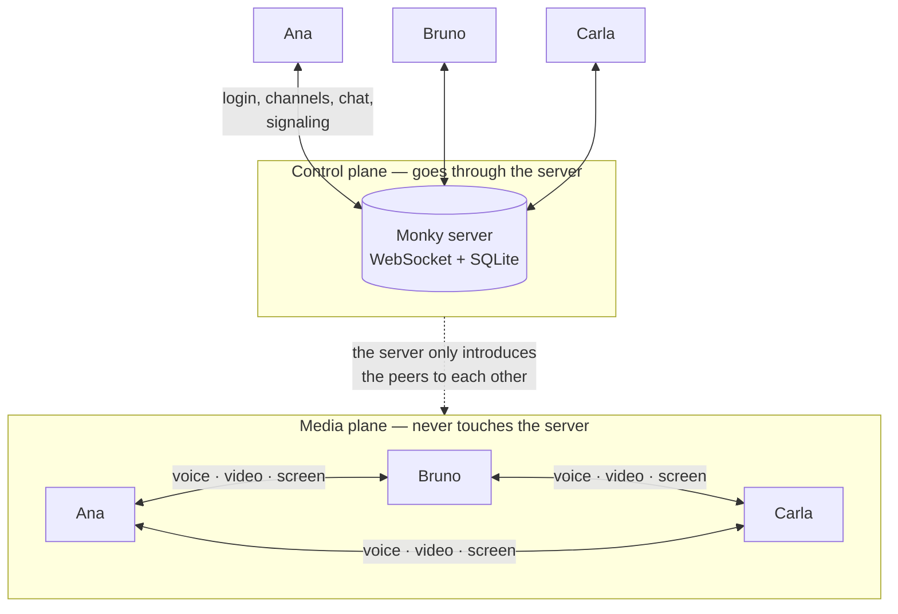

The server handles login, channels, chat, roles and **signaling**. It introduces
participants to each other and then steps aside: voice, video and screen travel
**P2P over WebRTC**, without passing through it.

That has two consequences which explain nearly everything else in the project:

- **The server's bandwidth barely matters.** It carries no media, so a modest VPS
  is enough for the group. The bandwidth cost sits with the participants.
- **The conversation is not readable by the server.** Even the person hosting
  cannot listen in — WebRTC is encrypted end to end between the peers.

## The components

The repository is a monorepo with npm workspaces:

| Workspace | What it is |
|---|---|
| `apps/client` | The Electron app — the interface, and also the host when you host from the app itself |
| `apps/server` | The server: WebSocket, SQLite and the [Monky CLI](/en/cli) |
| `packages/shared` | The contract between the two: protocol types, validators, limits and quality profiles |

`packages/shared` is what stops client and server from drifting apart: both
import the **same** types and the **same** validators.

## The client

### Three processes

Electron splits the app into three contexts, and Monky respects that split:

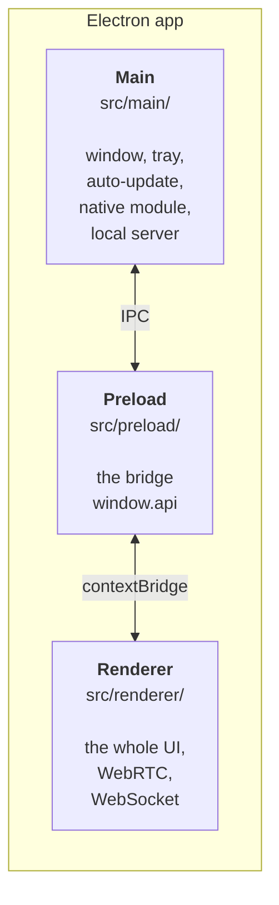

The renderer runs with `contextIsolation: true` and `nodeIntegration: false`: the
UI **has no access to Node**. Anything that needs the operating system — picking
a screen to share, reading the native audio module, touching the tray — goes
through the `window.api` bridge exposed by the preload.

### The UI uses no framework

Possibly the project's most unusual decision: **the renderer is plain TypeScript
and DOM**. There is no React, Vue or Svelte. Views build their own HTML with
template strings and re-render themselves.

State lives in singleton stores that emit events on a bus (`appEvents`), and
views subscribe to whatever concerns them:

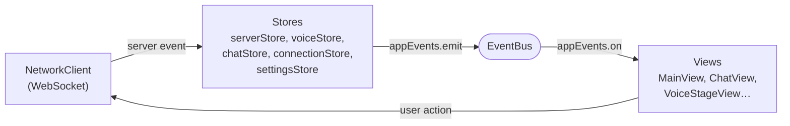

### The services

Every large client responsibility lives in its own class, under
`src/renderer/core/`:

| Service | Responsibility |
|---|---|
| `NetworkClient` | WebSocket, authentication, heartbeat and reconnection |
| `WebRtcManager` | The P2P connections: mesh, tracks, renegotiation |
| `AudioProcessor` | Microphone, noise suppression, speech detection |
| `VideoService` | Camera and screen capture |
| `ScreenAudioService` | Bridges the native screen-audio module into WebRTC |
| `ParticipantManager` | Who is online, in which channel and in what state |
| `SoundboardService` | Soundboard clips and shortcuts |
| `KeybindService` | Global shortcuts |
| `AttachmentUploader` | Chat attachment uploads |
| `UpdateService` | Update check and banner |

### What is stored on your machine

There is no local database, but it is not all `localStorage` either: the client
stores in **two places with different guarantees**, and the difference matters.

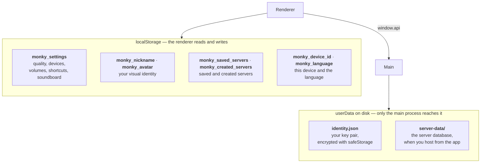

| Key | Contents |
|---|---|
| `monky_settings` | Preferences: quality, devices, volumes, shortcuts, soundboard |
| `monky_nickname` / `monky_avatar` | Your visual identity |
| `monky_saved_servers` | Servers you saved to reconnect to |
| `monky_created_servers` | Servers you created on this machine |
| `monky_device_id` | Identifies **this device** (lets the same person use two machines) |
| `monky_language` | Interface language |

The **private key is deliberately absent from that list**. It is what proves who
you are (see [Authentication](#authentication-the-server-never-sees-a-password-of-yours))
and it never reaches the renderer: it lives in `identity.json`, inside the
`userData` folder, encrypted with Electron's `safeStorage` — the operating
system's own vault. Where the system offers no encryption the file is written in
the clear, and the record itself says which of the two happened.

## The server

### The three ways to run it

The same server code goes up in three shapes, and the difference is not
technical — it is about who looks after it:

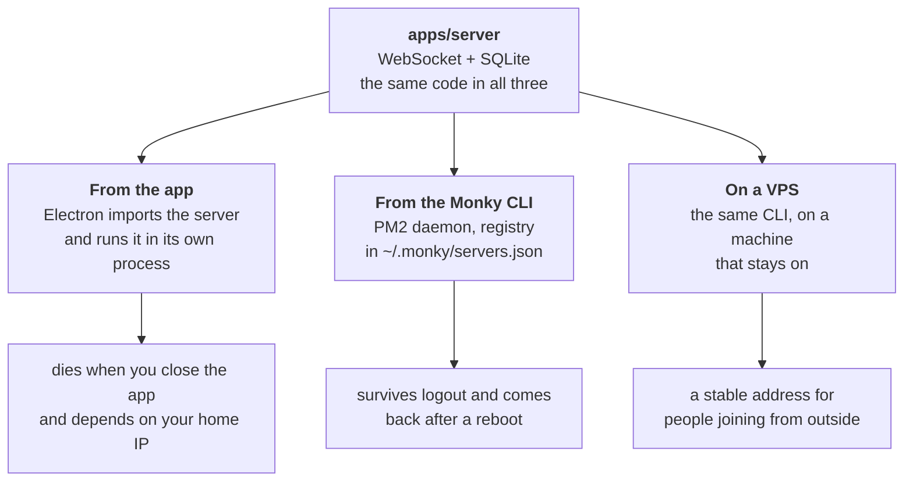

Hosting **from the app** is the two-click path, and that is why the client
imports `@monky/server` directly: no separate process, no admin port. The price
is that the server lives only as long as the app does.

The **CLI** exists for the opposite case — a server that should not depend on
somebody keeping a window open. It manages several servers on the same machine,
each with its own data folder and its own PM2 process.

### Layers

There is no dependency injection container: wiring is explicit, done by hand in
`MonkyServer.create()`. You can read the file and see exactly what depends on
what.

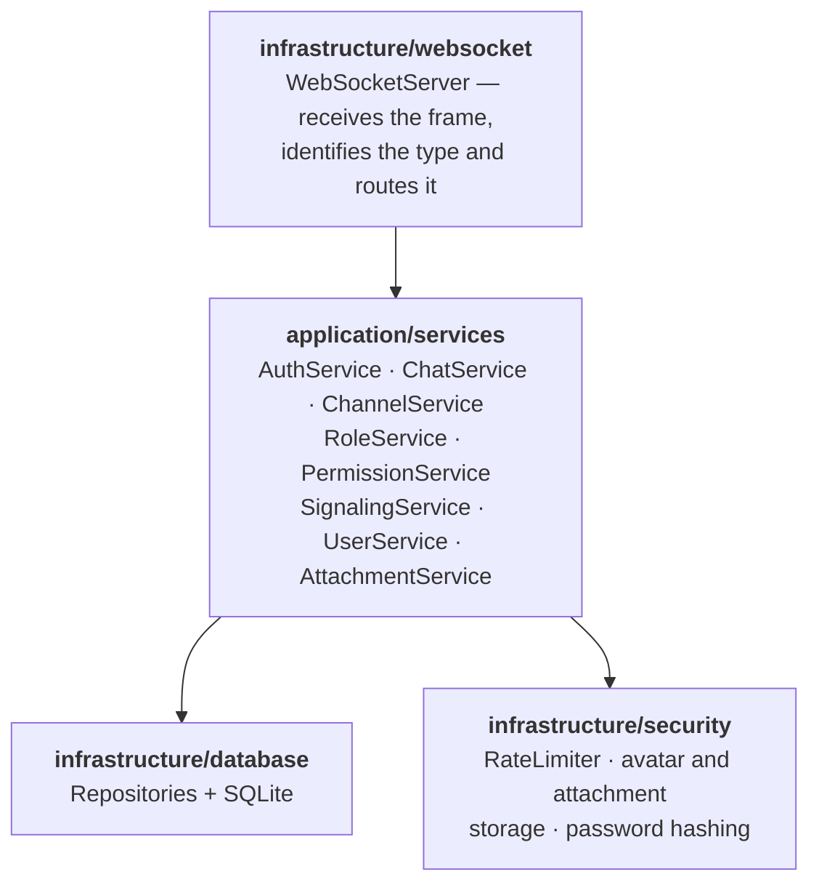

Beyond the WebSocket, the server exposes a few HTTP routes: `/health`, `/preview`
and `/invite-info` (public information for the invite screen), `/avatars/*` and
the `/attachments` upload/download.

The default port is **3000**.

### The protocol

Every message has the same shape:

```ts
{
  type: MessageType,     // 'CHAT_SEND', 'VOICE_JOIN', 'RTC_SIGNAL'…
  requestId?: string,    // echoed in the response, for correlation
  payload: T
}
```

The `requestId` is what lets the client know which response belongs to which
request — the WebSocket is asynchronous and responses do not necessarily arrive
in the order they were asked for.

Payload validation uses **zod**, with the schemas in `packages/shared` — the very
same ones the client uses to validate before sending.

::: warning The protocol version is exact, not compatible
`PROTOCOL_VERSION` (currently **3**) must be **identical** on both sides. There is
no negotiation and no compatibility mode: if the client sends a version different
from the server's, authentication is refused.

That is why bumping the protocol is always a breaking change and forces a
**major** release — there is even a CI check that fails the PR when this is not
respected.
:::

### Authentication: the server never sees a password of yours

Login is challenge–response with public-key cryptography. You have no account and
no sign-up: your identity **is** your key pair.

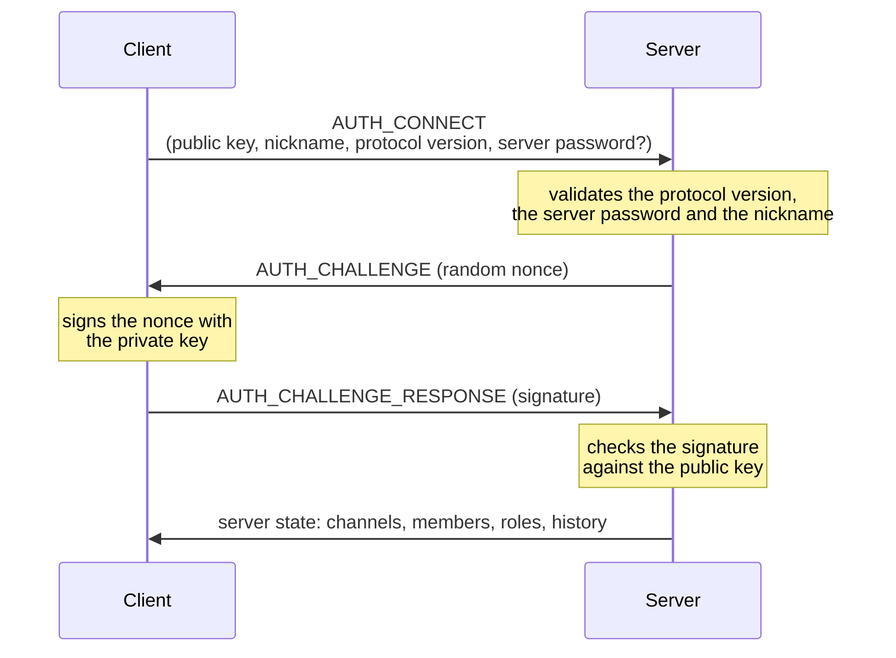

The `clientId` is derived from the public key itself, so it cannot be forged:
without the private key you cannot sign the challenge.

The server password, when there is one, protects *entry* — it is checked before
the challenge is issued.

### Sessions: the same person on several devices

A session is identified by `userId:deviceId`, not just by the user. That is what
lets you be on the desktop and the laptop at once while appearing as a single
person.

- Reconnecting **from the same device** replaces the old connection (avoiding
  ghosts after a network drop).
- Connecting **from another device** creates a new session, up to a cap of **3
  simultaneous sessions** per identity.

The cap exists so a single identity cannot exhaust the server's resources
(connections, audio, bandwidth) by opening endless devices. It is independent
from `maxUsers`, which counts *registrations* — several sessions of the same
person still take a single seat.

### Database

SQLite, in a `server.db` file inside the server's data directory. Migrations are
numbered `.sql` files, applied at startup and recorded in a `schema_migrations`
table — the server only runs what it has not run yet.

| Table | Holds |
|---|---|
| `server_meta` | Server configuration: name, password, owner, limits, icon |
| `users` | Members, each with their public key |
| `channels` | Voice and text channels |
| `messages` | Chat history |
| `mentions` | Mentions, for highlighting and notifying |
| `message_attachments` | Message attachments |
| `roles` / `user_roles` | Roles and who holds each one |
| `schema_migrations` | Bookkeeping of applied migrations |

### Roles and permissions

Permissions are bits combined into a mask. Two roles are special:

- **Admin** — gets every permission and cannot be deleted.
- **Member** — the default role for anyone who joins.

The check is centralised in `PermissionService.checkPermission()`. The **server
owner** is a case apart: they get admin permissions regardless of which roles
they hold.

### Abuse protection

| Protection | How |
|---|---|
| Message flood | Sliding window: 10 messages every 5 s |
| Message size | 2000 characters |
| Avatar | 5 MB, and the file must carry a PNG, JPEG or WebP signature |
| Attachments | Per-file limit and a total server budget, both configurable |
| Soundboard | Audio refused above ~4 MB |
| Path traversal | File names go through `basename` and the final path is checked against the allowed folder |

Note the detail on avatars: validation looks at the file's **magic bytes**, not
its extension. Renaming an executable to `.png` does not fool the check.

## The media plane

### Topology: full mesh

Each participant opens a direct connection to **every** other one.

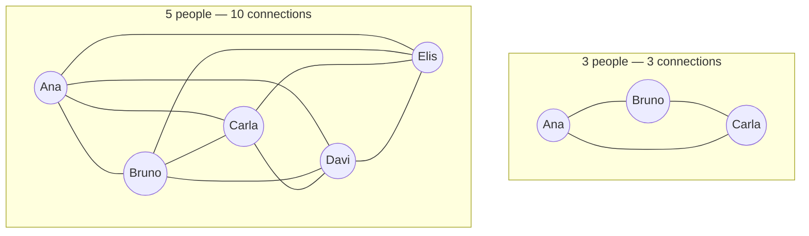

With **N** participants, each person keeps **N−1** connections and the channel has
**N(N−1)/2** in total. Whoever shares a screen sends the same video N−1 times,
once per peer.

::: tip Why mesh, and where it hurts
Mesh needs no media server: you can host Monky on a cheap VPS precisely because it
never carries video. The price is the **uplink of whoever is transmitting**, which
grows linearly with the number of listeners.

For the group of friends Monky serves, that is excellent. For dozens of people you
would need an SFU — and then the server would be carrying media again.
:::

### Signaling

The server only delivers envelopes. It rewrites the sender (so nobody can forge an
identity) and refuses delivery if the two peers are not in the same voice channel.

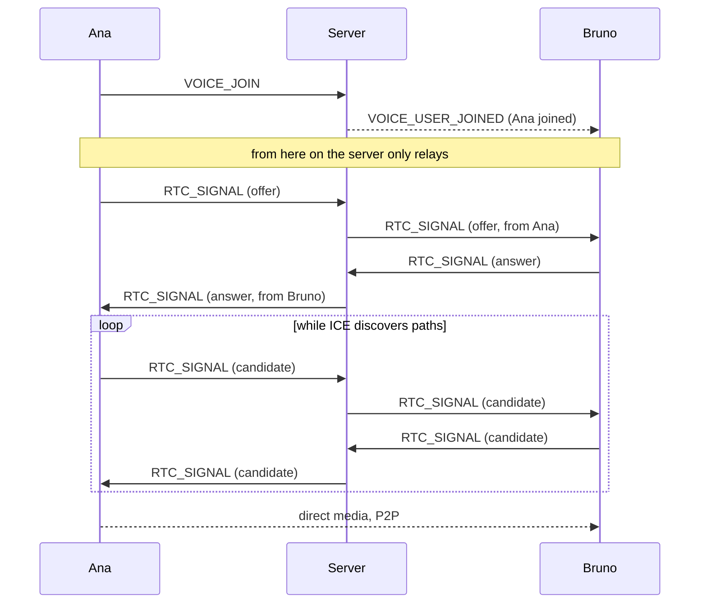

### Getting through NAT

Almost nobody has a direct public IP, so peers need to work out how to reach each
other. Monky uses public **STUN servers** (Google and Cloudflare) so each side can
discover its own external address.

::: tip TURN is optional, and off by default
STUN only *discovers* the path; it does not relay anything. When the network is too
restrictive — symmetric NAT, corporate firewall, some carrier CGNATs — there is no
direct path and the media connection fails.

A **TURN** server solves it by relaying the media. But TURN carries video, and
costs bandwidth proportional to usage — which reintroduces exactly the cost the
P2P architecture avoids. That is why Monky's relay is **optional** and ships
off: whoever hosts decides whether to pay that bandwidth.

When enabled, the server runs a **coturn** alongside it and hands out the
credentials at login. ICE still prefers the direct route and only uses the relay
for the pairs that genuinely cannot connect. Details in
[Media relay (TURN)](/en/turn).
:::

When a connection drops or stalls, `WebRtcManager` first tries an **ICE restart**
(renegotiating the path without tearing down the call) and, failing that, rebuilds
the connection to that peer from scratch.

### Audio

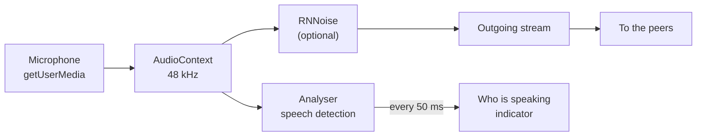

Capture already asks the browser for echo cancellation and automatic gain. Noise
suppression has one subtlety: when you turn on Monky's **RNNoise**, the browser's
native suppression is **turned off** — the two together fight each other and the
result is worse.

Mute and deafen disable the track (`enabled = false`) instead of removing it. That
way there is no need to renegotiate the connection on every click of the mute
button.

### Video and screen sharing

The camera follows the resolution and FPS of the selected quality profile.

Screen sharing is a track **separate** from the camera — you can transmit both at
once. When you start sharing, the connection is renegotiated and Monky sends a
`screen-video-meta` alongside it, so the other side knows that track is a screen
and not a face.

You can share **up to 2 screens at once**. Each is identified by the id of its own
`MediaStream`, and that id is what ties together the track, the sender and the
tile on screen.

Monky also tags the track with a content hint: `motion` favours smoothness (good
for games and video), `detail` favours sharpness (good for code and text).

### Screen audio: the native module

The browser does not hand over system sound together with the screen image. That
is why Monky has a native C++ module:

| Platform | How |
|---|---|
| **Windows** | WASAPI *process loopback* — captures system sound or a specific app's, excluding Monky itself so it does not echo |
| **macOS** | ScreenCaptureKit (macOS 13+), with a window filter so audio from apps you are not sharing does not leak |
| **Others** | Not supported — the app keeps working, just without screen audio |

If the module fails to load, nothing breaks: sharing keeps working without sound
and the app says so.

### Quality and bandwidth

Profiles control resolution, FPS and the bitrate ceiling, applied through
`RTCRtpSender.setParameters()`:

| Profile | Audio | Camera | Screen |
|---|---|---|---|
| **Economic** | 24 kbps | 640×360 @ 24fps · 250 kbps | 854×480 @ 15fps · 900 kbps |
| **Normal** | 32 kbps | 854×480 @ 30fps · 450 kbps | 1280×720 @ 30fps · 2000 kbps |
| **High Quality** | 48 kbps | 1280×720 @ 30fps · 600 kbps | 1920×1080 @ 30fps · 3500 kbps |
| **Gaming Mode** | 28 kbps | 640×360 @ 20fps · 300 kbps | 1920×1080 @ 60fps · 6000 kbps |

**Gaming Mode** is the most telling one: it *reduces* the camera to spend
everything on the screen at 60fps. And only there does the degradation preference
become `maintain-framerate` — under tight bandwidth Monky sacrifices resolution to
hold 60fps, because in a game smoothness matters more than sharpness. In the other
profiles it is the opposite.

Remember these numbers are **per peer**. Sharing a screen in High Quality to 4
people asks for roughly 14 Mbps of uplink.

### Telemetry

During a transmission Monky reads WebRTC statistics
(`RTCPeerConnection.getStats()`) every 1.5 s and shows the real FPS, resolution and
bitrate — on the sending side also codec and keyframes; on the receiving side
packet loss and jitter.

## Reconnection

When the WebSocket drops, the client tries to come back on its own with growing
waits (1s, 2s, 3s, 5s — the last one repeats). The server keeps the session alive
for **20 seconds** before announcing the departure, so a quick Wi-Fi hiccup does
not throw anyone off the list.

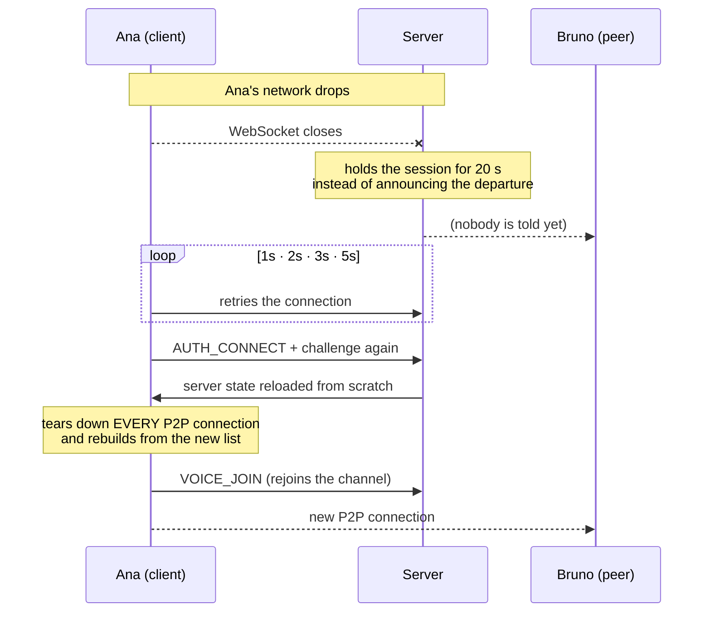

Notice the least intuitive step: on the way back the client **tears down every
P2P connection and starts over**, including the ones that looked alive. It sounds
drastic, but it is the most reliable path — while the WebSocket was away other
people may have joined, left or switched channels, and there is no way to know
which of the old peers still hold. Rebuilding from the new state is cheaper than
finding out, peer by peer, who is left.

If the 20 seconds run out before the client is back, the session is closed and
the departure is announced normally — the reconnection becomes a fresh join.

## Where everything lives

```
apps/
  client/
    native/screen-audio/     C++ screen-audio module (Windows/macOS)
    src/main/                main process: window, tray, updater, IPC
    src/preload/             the window.api bridge
    src/renderer/
      core/                  services: network, WebRTC, audio, video
      stores/                state + events
      views/                 the screens
      i18n/                  PT/EN translations
  server/
    src/application/         business rules (services)
    src/infrastructure/      WebSocket, database, security, logs
    src/cli/                 the Monky CLI
packages/
  shared/                    protocol, validators, limits, profiles
```

## Known limits

Things that follow directly from the architecture, and are not bugs:

- **Mesh does not scale.** Great for a handful of friends, bad for dozens. Moving
  past it would require an SFU.
- **TURN is off by default.** Very restrictive networks can prevent the media
  connection even when the server is reachable. An optional relay exists, but it
  costs the host bandwidth and only runs on Linux.
- **The protocol requires an exact match.** Client and server need the same
  `PROTOCOL_VERSION`; updating only one side breaks the connection.
- **Screen audio only on Windows and macOS**, because it depends on each system's
  native API.

## Learn more

- [Monky CLI](/en/cli) — command-line administration
- [Host on a VPS](/en/hospedar-em-vps) — putting a server online
- [Features](/en/recursos) — what the app does, from a user's point of view
- [CONTRIBUTING.en.md](https://github.com/MonkyOrg/Monky/blob/main/CONTRIBUTING.en.md) — how to contribute code
